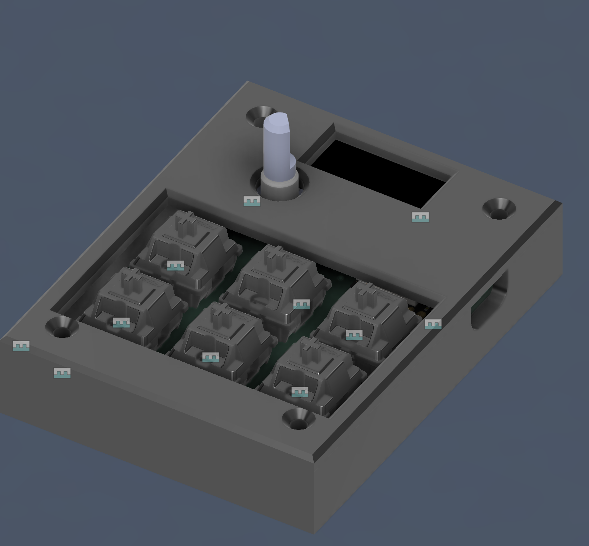
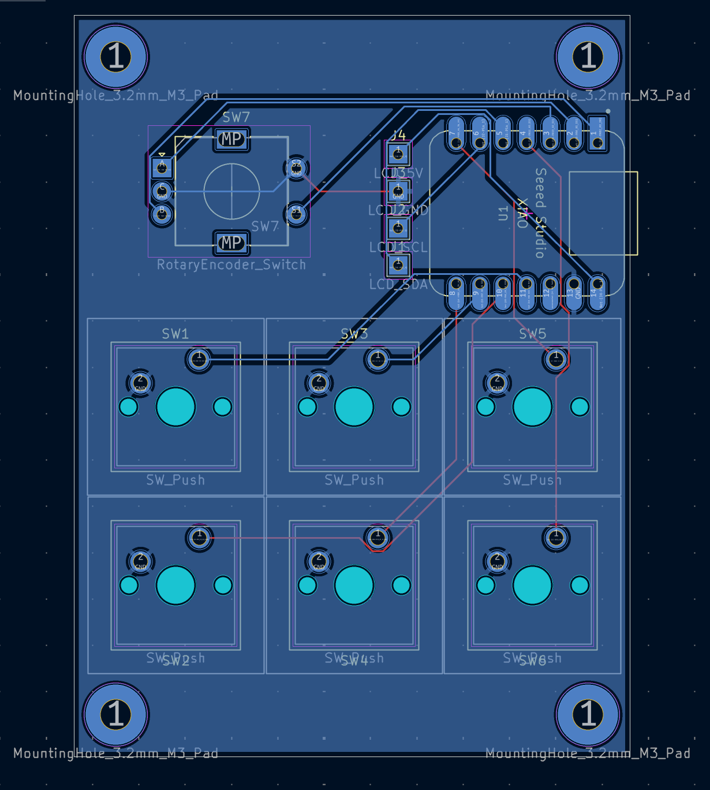
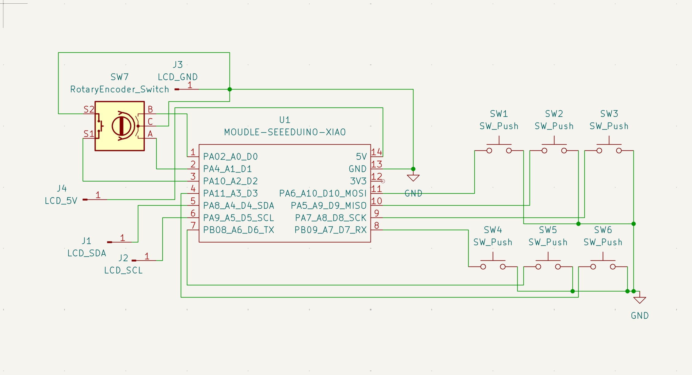

# CodePad

CodePad is a custom hack pad (macro pad) with 6 keys, a rotary encoder and a screen!
I designed this project for the Stardance Hackpad mission.

## Features

- 128x32 OLED Display
- EC11 Rotary encoder (for volume/anything)
- 6 Cherry MX-style keys

## CAD

CodePad is printed in two pieces, the lid and the case.
There are 4 screws that go through the lid, sqeeze down the pcb and go into threaded inserts in the bottom case.
You will need 4 M3 bolts and the threaded inserts for them.
This was made in Fusion360.

## PCB

The PCB was made in KiCad. I added a ground plane.

## Firmware

I have not wrote the firmware yet and I will when my PCB arrives from JclPcb.
When I do, I will probably use QMK. I also want to include a virtual pet on the screen and make it wake and sleep based on if you are typing or not.

## Parts needs

- 6x Cherry MX Switches
- 6x DSA Keycaps
- 1x 0.91" 128x32 OLED Display
- 1x EC11 Rotary Encoder
- 1x XIAO RP2040
- 4x M3 bolts
- 4x M3 heat-set threaded inserts
- 1x Case (2 3D printed parts)
- 1x PCB (2 layer)